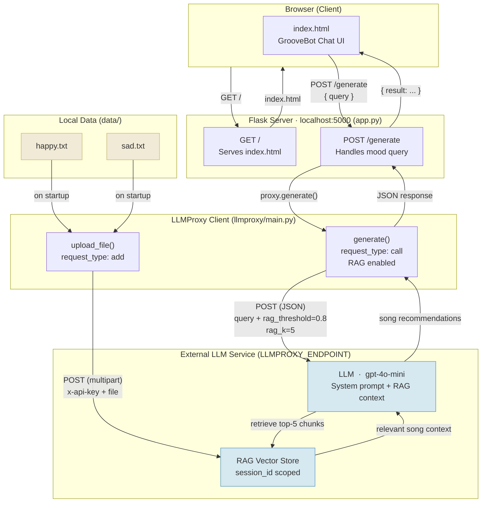

loom demo: https://www.loom.com/share/68867d69e0114d25bc53401499226a11

Explicitly name your original project (from Modules 1-3) and provide a 2-3 sentence summary of its original goals and capabilities.
This is my creative twist on a combination of the mood machine and the music recommender projects. The mood machine classifies the mood of text based on 
mappings given to it with examples of phrases mapped to certain emotions, and the music recommender suggested songs to users based on a .csv file 
containing a list of 16 songs and classifications of there genre, mood, energy, etc. This new project is a little less hard-coded
to make it more useful for a larger audience. It also has a nice, accessible interface designed as a chatbot that receives and outputs human-like text.

Title and Summary: What your project does and why it matters.
GrooveBot
An AI chatbot that recommends 2-3 songs to you based on your mood. You tell it how you're feeling and it'll find the perfect songs to match your current
mood, as well as give you a short explanation of why each song is a good match.

Architecture Overview: A short explanation of your system diagram.
# GrooveBot System Diagram

## Component Summary

| Component | Role |
|-----------|------|
| `index.html` | Chat UI — collects user mood, displays song recommendations |
| `app.py` | Flask server — serves UI, proxies queries, uploads data on startup |
| `llmproxy/main.py` | HTTP client — wraps the external LLM endpoint (file upload + generation) |
| `data/happy.txt`, `data/sad.txt` | Song knowledge base uploaded to RAG on startup |
| External LLM service | Stores RAG vectors, retrieves relevant songs, generates recommendations |

## Key Flows

**Startup** — `app.py` scans `data/`, uploads every `.txt` file to the external service's RAG store under `SESSION_ID = "my-app-session"`.

**User query** — Browser POSTs mood text → Flask calls `proxy.generate()` → service retrieves the top-5 most relevant song chunks (threshold 0.8) → LLM produces a recommendation → response bubbles back to chat UI.

**Safety guard** — System prompt instructs the LLM to detect depression/suicidal signals and redirect to a medical professional instead of recommending songs.

Setup Instructions: Step-by-step directions to run your code.
1. Install Flask with ' pip install flask flask-cors requests python-dotenv '
2. Create a .env file containing:
   LLMPROXY_ENDPOINT=https://your-endpoint
   LLMPROXY_API_KEY=your-api-key
   and replace the endpoint and api key with your own
3. run it with ' python app.py '
4. Open http://localhost:5000 in your browser to see the chatbot

Sample Interactions: Include at least 2-3 examples of inputs and the resulting AI outputs to demonstrate the system is functional.
1. input: im really pumped for this workout, give something to listen to
   output: That's awesome to hear! Here are a few high-energy songs that are perfect for getting you pumped up during your workout:

  1. **"Eye of the Tiger" by Survivor** - This classic anthem is often associated with motivation and perseverance, making it an ideal choice to push you through those tough moments.
  
  2. **"Lose Yourself" by Eminem** - This intense track encourages you to seize the moment and give it your all, making it a great companion for a workout that demands focus and energy.
  
  3. **"Can't Hold Us" by Macklemore & Ryan Lewis** - This upbeat track has an infectious energy that can really elevate your spirits and keep you moving throughout your workout.
  
  Enjoy your session!

2. input: im sad i need a cry
   output: I'm sorry to hear that you're feeling sad. Here are a few songs that can resonate with those emotions and help you release some feelings:

    1. **"Skinny Love" by Bon Iver** - This song captures the feeling of heartbreak and longing, with its raw and emotional lyrics that many find relatable in times of sadness.
    
    2. **"Someone Like You" by Adele** - Adele's powerful voice and heartfelt lyrics about loss and acceptance can be cathartic, allowing for a good cry.
    
    3. **"Breathe Me" by Sia** - This song encapsulates feelings of vulnerability and despair, making it a poignant choice for when you need to let your emotions flow.
    
    Remember, it's okay to feel sad sometimes. Take care of yourself!

Design Decisions: Why you built it this way, and what trade-offs you made.
I chose to make it a chatbot for the ease of interaction. It feels like you're interacting with another person because of how you can type in a very
casual way and receive a response that shows it clearly considered the emotion you expressed in your prompt. It feels personalized and it can easily
be used whenever you need a quick song suggestion.
I did not make any tradeoffs, and am happy with how it turned out.

Testing Summary: What worked, what didn't, and what you learned.
I tested my guardrails by inputting test messages that reference depression/suicide/other severe emotional circumstances, and it passed in that it
did not give suggestions upon those kinds of messages and instead encouraged the user to contact a medical professional. However it was able to 
detect when a user was just sad or feeling low with nothing too severe and was able to cater to that.

Reflection: What this project taught you about AI and problem-solving.
This taught me the importance of system prompts to get the AI to do what you want it to and also to stay within your guardrails.
