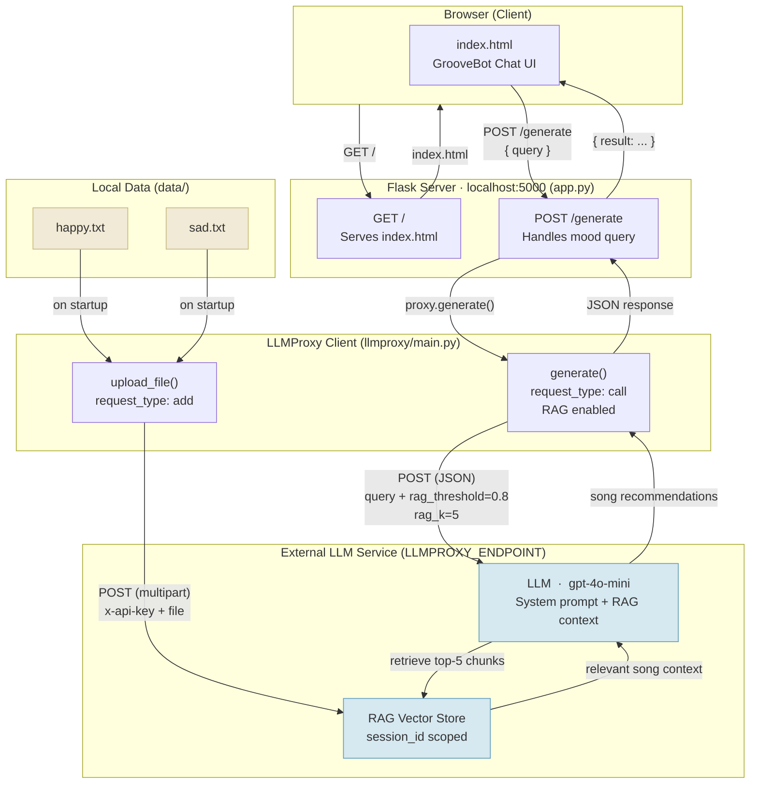

# GrooveBot System Diagram

## Component Summary

| Component | Role |
|-----------|------|
| `index.html` | Chat UI — collects user mood, displays song recommendations |
| `app.py` | Flask server — serves UI, proxies queries, uploads data on startup |
| `llmproxy/main.py` | HTTP client — wraps the external LLM endpoint (file upload + generation) |
| `data/happy.txt`, `data/sad.txt` | Song knowledge base uploaded to RAG on startup |
| External LLM service | Stores RAG vectors, retrieves relevant songs, generates recommendations |

## Key Flows

**Startup** — `app.py` scans `data/`, uploads every `.txt` file to the external service's RAG store under `SESSION_ID = "my-app-session"`.

**User query** — Browser POSTs mood text → Flask calls `proxy.generate()` → service retrieves the top-5 most relevant song chunks (threshold 0.8) → LLM produces a recommendation → response bubbles back to chat UI.

**Safety guard** — System prompt instructs the LLM to detect depression/suicidal signals and redirect to a medical professional instead of recommending songs.
